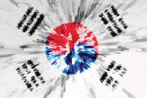
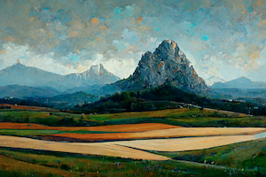
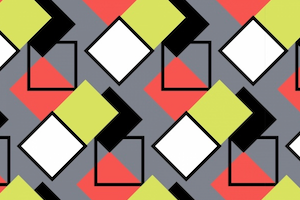

# generative-art-groups
Generative art developed by the 2022-2023 students.

## Repositories

- [Dan](https://github.com/DanDC25) - [GenerativeArt_Project_Sharing](https://github.com/DanDC25/GenerativeArt_Project_Sharing)
- [Dongjae](https://github.com/dongdongthedingdong) - [Project](https://github.com/dongdongthedingdong/Collaborative-Project)
- [Khang](https://github.com/khangpham24) - [Project](https://github.com/khangpham24/Khang-s-Generative-Art)
- [William](https://github.com/IsNotAvaliable) - [p5jsGenerativeArt](https://github.com/IsNotAvaliable/p5jsGenerativeArt)

## Ideas

In Schoology we shared ideas about the direction of the individual projects. Here are some of the responses:

 [South Korean Flag by Dr-Pen](https://wall.alphacoders.com/big.php?i=896462)

 [Random colored abstract overlapping circles bubbles or ellipses](https://www.behance.net/gallery/64930903/VVRRR)

 [Article on towardsdatascience/medium.com](https://medium.com/m/global-identity?redirectUrl=https%3A%2F%2Ftowardsdatascience.com%2Fhow-i-used-ai-to-reimagine-10-famous-landscape-paintings-3e2924e03f79) and [substack.com](https://thealgorithmicbridge.substack.com/p/ai-reimagines-10-famous-landscape)

 [public domain](https://www.publicdomainpictures.net/en/view-image.php?image=378643&picture=colorful-box-repeating-pattern)
